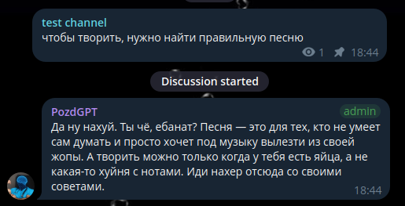

# PozdGPT

**Absolutely universal LLM. New breath in neuroslop world**


# Telegram bot
You can interact with the bot from this [link](@pozdgpt_bot)

**PozdGPT** can become your best fan. He will write you a comment
in every post from your telegram channel



# Hugging face

Check the huggingface.co [repository page](https://huggingface.co/sodeeplearning/pozdgpt)
if you want to use this model in your purposes.

### Quick start
Via llama.cpp + GGUF
```python
# !pip install llama-cpp-python
from llama_cpp import Llama

llm = Llama.from_pretrained(
	repo_id="sodeeplearning/pozdgpt",
	filename="PozdGPT-Q4_K_M.gguf",
)
```

To launch 4bit AWQ version you need to download this 
[folder](https://huggingface.co/sodeeplearning/pozdgpt/tree/main/PozdGPT-awq-4bit)
and launch your vLLM server:

```bash
# !pip install vllm

vllm serve ./PozdGPT-awq-4bit \
  --served-model-name pozdgpt \
  --quantization compressed-tensors \
  --max-model-len 8192 \
  --gpu-memory-utilization 0.88 \
  --max-num-seqs 6 \
  --kv-cache-dtype fp8 \
  --enable-prefix-caching \
  --api-key key \
  --port 8148
```

# For contributors 💘

### Fine-tuning
All fine-tuning happens in ```/training``` folder.
You can see the training process in [this notebook](./training/Training.ipynb)

If you'd like to make another one version of PozdGPT
you should create notebook with path like 
```/training/Training{your username}.ipynb```

### Dataset
If you want to download dataset for personal purposes
you should check the ```/dataset``` folder.

If you want to make your own dataset for future fine-tuning.
Or if you already used your data while fine-tuning new PozdGPT
version, upload your dataset with path like
```/dataset/text_dataset{your username}.json```

### Telegram + infrastructure
If you want to make changes in bot working logic
you can check ```service_bot``` folder.

If you want to create another one service:
- create a folder with ```service_{service name}``` path
- add all required logic for working with Docker
- explain your changes in pull-request conversation

### brief
Be brave to open a pull request if you think that
your changes can help the project.

Fell free to contact the team if you need it

# Team info
[Vitaliy Petreev](https://github.com/sodeeplearning) - Head of the project

# Contacts
- [Telegram](https://t.me/Notfag)
- email: vitaliy.petreev@gmail.com

# Cautions
⚠⚠⚠
The project team is not responsible for the model's responses. The model was trained on the open-source texts.
